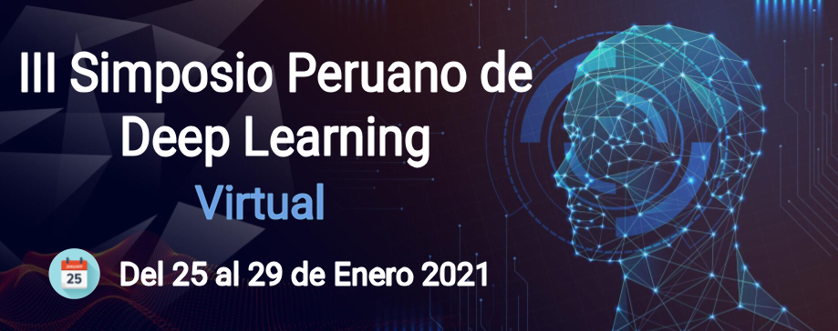

# III Simposio Peruano de Deep Learning

Contenido del "III Simposio Peruano de Deep Learning (SPDL)”, el cual fue realizado del 25 al 29 de enero de forma virtual.

Se llevaron a cabo las siguientes actividades:

- Presentación de tutoriales, por parte de especialistas en el área.
- Presentación de trabajos de investigación con tópicos relacionados a deep learning.
- Paneles de discusión.
- Sesiones de mentoría.

## Presentaciones

### Tutoriales

Tema  | Slides | Video | Código & Adicional |
-----| :-: | :-: | :-: |
An Introduction to Deep Learning for Computer Vision | `None` |  | `None`
Procesamiento del Lenguaje Natural |  |  |  
Graph Neural Network and Node Classification |  |  | 
Modelos Generativos |  |  | 
